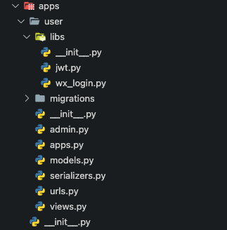

上一篇 [Django 从开发到部署](/django) 介绍了 Django 的基本操作。这篇将基于上一篇的代码，来扩展一个用户模块。

该模块基于 Django 自带的 auth 模块进行扩展，并实现了微信扫码登录的后端功能。

### 模块概览


<br />

其中：

- **user/libs:** 用户模块相关工具库。
- **user/libs/jwt:** jwt 相关工具库，包括 token 的创建、校验、登录状态中间件。
- **user/libs/wx_login:** 微信登录相关工具库。

...

> 其他文件就是 Django 的套路了，不一一介绍了。

### 表结构设计

分成两张表，一张是用户表（User），一张是 Oauth 登录信息表（Oauth）。

1. User 表

继承 django.contrib.auth.models.AbstractUser

nickname 昵称 </br>
avatar_url 头像 </br>
gender 性别 </br>
phone_number 电话号码

2. Oauth 表

user 外键指向某个用户 </br>
oauth_type 渠道（微信或者其他渠道） </br>
oauth_id 渠道提供的该用户的唯一 id </br>
created_time 创建时间 </br>
last_mod_time 最后修改时间

### 微信扫码登录流程

请先阅读官方文档：[微信登录流程](https://developers.weixin.qq.com/doc/oplatform/Website_App/WeChat_Login/Wechat_Login.html)。

流程已经很清晰了：

1. 获取 code
2. 通过 code 获取 access_token
3. 使用 access_token 去获取用户信息（unionid、用户昵称、用户头像）
4. 后端将微信 unionid 和 数据库中的用户信息进行对应，完成用户登录

#### 前端要做的事情

```js
// 先引入 http://res.wx.qq.com/connect/zh_CN/htmledition/js/wxLogin.js

var obj = new WxLogin({
  self_redirect: true,
  id: 'login_container',
  appid: '',
  scope: '',
  redirect_uri: '',
  state: '',
  style: '',
  href: '',
});
```

好好研究上面这段代码的传参，其实已经明确了流程。

1. 参数 id

这段代码会在 id 对应的 dom 节点上渲染一个 iframe 元素，在这个 iframe 元素中展示的是登录用的二维码。

2. 参数 redirect_uri

在用户扫码之后，点击了确认授权，该 iframe 会发起一个重定向请求到 redirect_uri，而在它的 query 中会携带上 code。而这个 redirect_uri 便是我们后端要开的一个接口（这边称它为 callback 接口）。

到这步为止，其实已经完成第一步，后端已经获取到 code 了，二三两步自然能很容易在后端完成。

那么，还有个问题，后端 callback 接口中处理完 1 ～ 4 步，用户已经登录成功，怎么通知前端页面呢？

我的方案是：

1. 后端再提供一个供前端轮询的接口，前端加载出二维码之后开始发起轮询， 轮询的时候带一个 uuid。如果接口返回中带有 token，表示用户已登录成功，否则继续轮询。

2. 前端在 redirect_uri 中也带上 1 中的那个 uuid，后端在 callback 接口中获取到该 uuid，以该 uuid 为 key，将登录完成后的 token 存在 redis 中。在 1 的轮询接口中，
   使用 uuid 为 key 去 redis 中查询，如果 token 存在则表明用户已登录，返回 token，否则未登录。

> uuid 可以放在 state 参数中，因为 state 参数会自动拼接到 redirect_uri 里去

#### 后端要做的事情

后端需要提供两个接口：

1. login/wx/

2. login/wx/callback/

第一个接口供前端轮询是否已经登录成功；第二个接口是用户授权后 iframe 重定向的地址，在该接口中可以获取到 code，进而处理用户登录逻辑。
