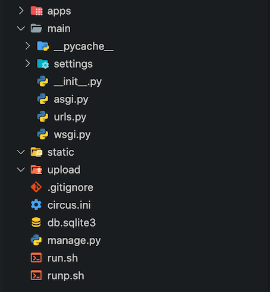
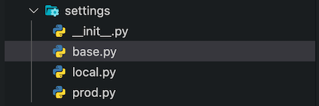

Django 是一个由 Python 编写的一个开放源代码的 Web 应用框架。

使用 Django，只要很少的代码，Python 的程序开发人员就可以轻松地完成一个正式网站所需要的大部分内容，并进一步开发出全功能的 Web 服务 Django 本身基于 MVC 模型，即 Model（模型）+ View（视图）+ Controller（控制器）设计模式，MVC 模式使后续对程序的修改和扩展简化，并且使程序某一部分的重复利用成为可能。

## 本地开发篇

### 1. 环境搭建

> 安装过程在 mac 系统下进行。

本地安装 [python 3.9](https://www.python.org/ftp/python/3.9.2/python-3.9.2-macosx10.9.pkg)，一路下一步直到安装完成。

创建虚拟环境。

```shell
python3.9 -m pip install --upgrade pip
python3.9 -m pip install virtualenv
python3.9 -m pip install virtualenvwrapper

# 找到 virtualenvwrapper 和 python3.9 的路径
which virtualenvwrapper.sh
which python3.9

# 编辑 zshrc
vim ~/.zshrc
# 加入以下内容
export WORKON_HOME='~/.virtualenvs'
export VIRTUALENVWRAPPER_PYTHON='/Library/Frameworks/Python.framework/Versions/3.9/bin/python3.9'
source /Library/Frameworks/Python.framework/Versions/3.9/bin/virtualenvwrapper.sh

source ～/.zshrc

# 创建虚拟环境
mkvirtualenv -p python3.9 django-demo
workon django-demo
```

### 2. 安装依赖

安装 Django 并使用相关命令初始化一个 Django 项目。

> Django == 3.1.7

```shell
pip install django djangorestframework
django-admin startproject django_demo
```

启动项目。

```shell
python manage.py runserver
```

### 3. 调整项目结构

初始项目结构很难满足复杂项目的需求，需要对目录结构进行改造。


<br />

按 Django 的说法，整个项目是一个大的 project，里面包含了若干应用。

但我更喜欢称整个项目为一个后台应用，比如 XX 产品的后台应用，而里面包含的若干应用我则称他们为应用中的模块。

其中：

- **main:** 应用主模块，里面包含了应用设置、asgi、wsgi 和路由文件，是整个应用的入口。
- **main/settings:** 项目配置，从原本的 `settings.py` 改成了 python 模块的形式，应对本地和服务器不同环境的配置。
- **apps:** 应用中模块的集合。
- **static:** 静态资源存放的位置。
- **upload:** 上传文件存放的位置，文件上传一般在 admin 端的场景比较多。
- **circus.ini:** circus 是一个进程管理工具，跑在服务器上，这个文件里写着它的配置。
- **run.sh** 本地操作项目相关命令。
- **run.sh** 服务器操作项目相关命令。

#### main/settings

settings 目录的结构如下。


<br />

**main/settings/base.py**

```py
from pathlib import Path

'''
Base Settings
'''
BASE_DIR = Path(__file__).resolve().parent.parent.parent
SECRET_KEY = 'pn^36-v(tvw=52%&kqb+t9h4iwrwiiv#xsic+7#69y^_57%&nb'
WSGI_APPLICATION = 'main.wsgi.application'
ASGI_APPLICATION = 'main.asgi.application'


'''
Internationalization
'''
USE_TZ = True
USE_L10N = True
USE_I18N = True
FILE_CHARSET = 'utf-8'
DEFAULT_CHARSET = 'utf-8'
LANGUAGE_CODE = 'zh-Hans'
TIME_ZONE = 'Asia/Shanghai'


'''
Security
'''
CORS_ALLOW_CREDENTIALS = True
CORS_ORIGIN_ALLOW_ALL = True
CORS_ALLOW_METHODS = (
    'DELETE',
    'GET',
    'OPTIONS',
    'PATCH',
    'POST',
    'PUT',
    'VIEW'
)
CORS_ALLOW_HEADERS = (
    'accept',
    'accept-encoding',
    'authorization',
    'content-type',
    'dnt',
    'origin',
    'user-agent',
    'x-csrftoken',
    'x-requested-with',
    'idToken',
)

ALLOWED_HOSTS = ['*']


'''
Application definition
'''
INSTALLED_APPS = [
    'django.contrib.admin',
    'django.contrib.auth',
    'django.contrib.contenttypes',
    'django.contrib.sessions',
    'django.contrib.messages',
    'django.contrib.staticfiles',
]

MIDDLEWARE = [
    'django.middleware.security.SecurityMiddleware',
    'django.contrib.sessions.middleware.SessionMiddleware',
    'django.middleware.common.CommonMiddleware',
    'django.middleware.csrf.CsrfViewMiddleware',
    'django.contrib.auth.middleware.AuthenticationMiddleware',
    'django.contrib.messages.middleware.MessageMiddleware',
    'django.middleware.clickjacking.XFrameOptionsMiddleware',
]

ROOT_URLCONF = 'main.urls'

TEMPLATES = [
    {
        'BACKEND': 'django.template.backends.django.DjangoTemplates',
        'DIRS': [BASE_DIR / 'templates'],
        'APP_DIRS': True,
        'OPTIONS': {
            'context_processors': [
                'django.template.context_processors.debug',
                'django.template.context_processors.request',
                'django.contrib.auth.context_processors.auth',
                'django.contrib.messages.context_processors.messages',
            ],
        },
    },
]
```

**main/settings/local.py**

```py
from .base import *


'''
Base Settings
'''
DEBUG = True


'''
Static and media files
'''
STATIC_ROOT = BASE_DIR / 'static'
MEDIA_ROOT = BASE_DIR / 'upload'
STATIC_URL = '/static/'
MEDIA_URL = '/media/'


'''
Database
'''
DATABASES = {
    'default': {
        'ENGINE': 'django.db.backends.sqlite3',
        'NAME': BASE_DIR / 'db.sqlite3',
    }
}
```

##### main/settings/prod.py

```py
from .base import *


'''
Base Settings
'''
DEBUG = False


'''
Static and media files
'''
STATIC_ROOT = '/data/django_demo/static'
MEDIA_ROOT = '/data/django_demo/upload'
STATIC_URL = '/static/django_demo/'
MEDIA_URL = '/media/django_demo/'


'''
Database
'''
DATABASES = {
    'default': {
        'ENGINE': 'django.db.backends.sqlite3',
        'NAME': '/data/django_demo/db.sqlite3'
    }
}
```

这里可以看到本地调试的配置和生产环境的配置是不同的，具体的不同在于数据库、静态资源、上传资源位置不同。

#### 跑起来自带 Admin 后台管理系统

首先要编写 `run.sh` 脚本，方便运行前设置一些环境变量。

**run.sh**

```shell
MODE=$1

export DJANGO_SETTINGS_MODULE=main.settings.local

if [[ $MODE = 'makemigrations' ]]; then
    python manage.py makemigrations
elif [[ $MODE = 'migrate' ]]; then
    python manage.py migrate
elif [[ $MODE = 'collectstatic' ]]; then
    python manage.py collectstatic
elif [[ $MODE = 'createsuperuser' ]]; then
    python manage.py createsuperuser
else
    python manage.py runserver 0.0.0.0:8000
fi
```

执行以下命令后就可以登录 Django 自带的 admin 后台看看了。

```shell
chmod +x ./run.sh
./run.sh migrate
./run.sh collectstatic
./run.sh createsuperuser
./run.sh
```

### 4. 部署

本地跑起来没啥问题了，就可以将项应用部署到服务器上了。

#### 本地操作

编写 circus 配置文件。

**circus.ini**

```ini
[circus]
check_delay = 5
endpoint = tcp://127.0.0.1:5555
pubsub_endpoint = tcp://127.0.0.1:5556
statsd = true
[env:web]
LC_ALL=en_US.UTF-8
LANG=en_US.UTF-8
DJANGO_SETTINGS_MODUL=django_demo.settings.prod
[watcher:web]
working_dir = /opt/django_demo
cmd = /usr/local/bin/uvicorn --fd $(circus.sockets.web) django_demo.asgi:application
use_sockets = True
copy_env = True
numprocesses = 3
autostart = True
stdout_stream.class = FileStream
stdout_stream.filename = /data/django_demo/logs/deploy.log
stdout_stream.max_bytes = 10485760
stdout_stream.backup_count = 4
[socket:web]
host = 127.0.0.1
port = 8000
```

编写 `runp.sh` 文件。

**runp.sh**

```shell
MODE=$1

export DJANGO_SETTINGS_MODULE=main.settings.prod

if [[ $MODE = 'makemigrations' ]]; then
    python3.9 manage.py makemigrations
elif [[ $MODE = 'migrate' ]]; then
    python3.9 manage.py migrate
elif [[ $MODE = 'collectstatic' ]]; then
    python3.9 manage.py collectstatic
elif [[ $MODE = 'createsuperuser' ]]; then
    python3.9 manage.py createsuperuser
else
    python3.9 manage.py runserver 0.0.0.0:8000
fi
```

导出本地依赖，并上传至 Github。

```shell
pip freeze > requirements.txt
git push ...
```

#### 服务器操作

远程登录服务器，下载代码。

```shell
cd /opt
git clone xxx/django_demo
cd django_demo
```

在服务器中直接安装 python3.9，安装过程视具体操作系统而定。

安装 python 依赖。

```shell
python3.9 -m pip install -r requirements.txt
python3.9 -m pip install uvicorn circus
```

##### 配置 Nginx

创建 django_demo 的专属配置，并在 `nginx.conf` 中导入该配置。

**django_demo.conf**

```conf
server {
    listen         80;
    server_name    localhost;
    charset UTF-8;

    client_max_body_size 2000m;
    client_body_buffer_size 20m;
    client_body_temp_path /tmp/nginx/client_body_temp;

    location ^~ /ws {
        proxy_pass http://127.0.0.1:8000;
        proxy_http_version 1.1;
        proxy_set_header Upgrade $http_upgrade;
        proxy_set_header Connection "upgrade";
    }

    location ^~ /api {
        proxy_pass http://127.0.0.1:8000;
    }

    location ^~ /django_demo {
        proxy_pass http://127.0.0.1:8000;
    }

    location ^~ /static/ {
        alias /data/django_demo/static/;
        autoindex on;
    }

    location ^~ /media/ {
        alias /data/django_demo/upload/;
        autoindex on;
    }
}
```

##### 运行项目

在服务未运行时启动（一般都是服务已经在跑了，有改动后只需要 circusctl restart 就行）。

```shell
sudo -E env "DJANGO_SETTINGS_MODULE=main.settings.prod" circusd /opt/django_demo/circus.ini
```

如果它工作正常，你可以将其作为守护进程启动。

```shell
sudo -E env "DJANGO_SETTINGS_MODULE=main.settings.prod" circusd --daemon /opt/django_demo/circus.ini
```

重启/停止。

```shell
circusctl restart/stop
```

Django 其他操作。

```shell
./runp makemigrations/migrate/collectstatic/createsuperuser
```
